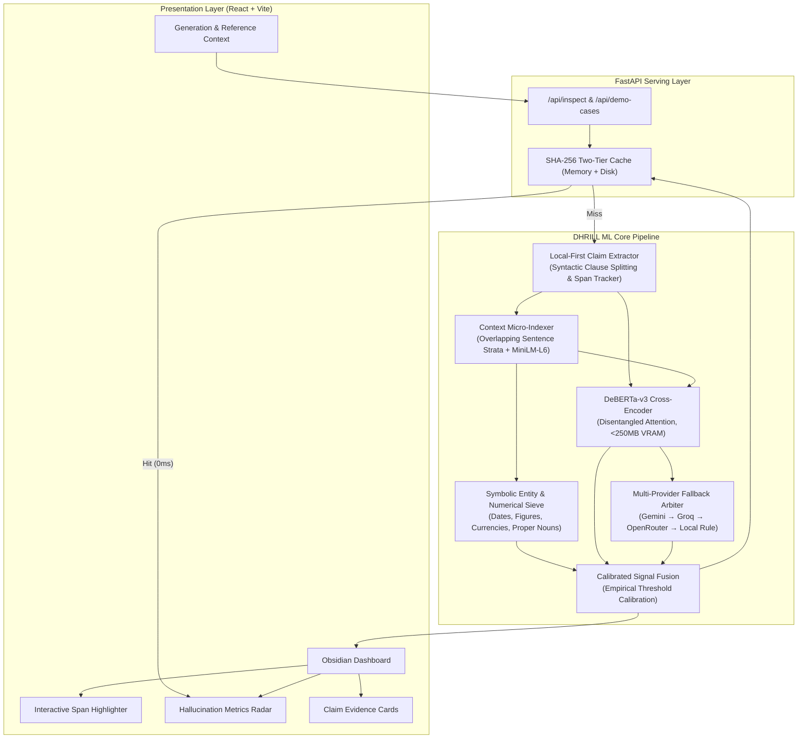

# DHRILL System Architecture Specification

## 1. High-Level Architectural Topology

DHRILL is architected as an asynchronous, decoupled, multi-tier hallucination detection system. It optimizes for sub-50ms inference latency, zero API dependency on commodity local hardware, and 100% demo resilience.

---

## 2. Mathematical Formalism

### 2.1 Atomic Proposition Decomposition
Given an input generated passage $G$, the claim extractor decomposes $G$ into an ordered sequence of atomic propositions:
$$\mathcal{C} = \{c_1, c_2, \dots, c_m\}$$
Each claim $c_i = (s_i, \tau_i^{\text{start}}, \tau_i^{\text{end}})$ retains its exact character start and end indices within $G$:
$$G[\tau_i^{\text{start}} : \tau_i^{\text{end}}] \approx s_i$$

### 2.2 Ephemeral Contextual Micro-Indexing
Given a reference context $R$, the context retriever divides $R$ into $n$ overlapping sentence strata $\mathcal{P} = \{p_1, p_2, \dots, p_n\}$.
Dense semantic vectors are computed via a lightweight bi-encoder $\mathbf{e}(t) = \text{MiniLM-L6}(t) \in \mathbb{R}^{384}$.
For each claim $c_i$, the top-$k$ grounding candidates are retrieved via hybrid scoring:
$$\text{Sim}(c_i, p_j) = \alpha \cdot \frac{\mathbf{e}(c_i) \cdot \mathbf{e}(p_j)}{\|\mathbf{e}(c_i)\| \|\mathbf{e}(p_j)\|} + (1 - \alpha) \cdot \mathcal{J}_{\text{lexical}}(c_i, p_j)$$
where $\alpha = 0.7$ and $\mathcal{J}_{\text{lexical}}$ represents token-level overlap.

### 2.3 Cross-Encoder Entailment Probability
For each claim $c_i$ and its top retrieved premise $p^* = \arg\max_{p \in \mathcal{P}} \text{Sim}(c_i, p)$, the cross-encoder computes:
$$\mathbf{z}_i = \text{DeBERTa-v3}([CLS] \circ p^* \circ [SEP] \circ c_i \circ [SEP])$$
$$\mathbf{P}_i = \text{softmax}(\mathbf{z}_i) = [P_i^{\text{contra}}, P_i^{\text{entail}}, P_i^{\text{neutral}}]$$

### 2.4 Multi-Signal Calibrated Decision Function
Let $\mathcal{E}(c_i, p^*)$ be the set of symbolic discrepancies extracted by the entity sieve. The verdict $\mathcal{V}(c_i)$ is defined as:

$$\mathcal{V}(c_i) = \begin{cases}
\text{CONTRADICTED}, & \text{if } |\mathcal{E}(c_i, p^*)| > 0 \lor P_i^{\text{contra}} \ge T_{\text{contra}} \\
\text{VERIFIED}, & \text{if } P_i^{\text{entail}} \ge T_{\text{entail}} \land |\mathcal{E}(c_i, p^*)| = 0 \\
\text{UNGROUNDED}, & \text{if } P_i^{\text{neutral}} \ge T_{\text{neutral}} \land \text{Sim}(c_i, p^*) < \theta_{\text{relevance}} \\
\text{ARBITRATE}, & \text{if } |P_i^{\text{contra}} - P_i^{\text{entail}}| \le \Delta_{\text{margin}} \\
\text{AMBIGUOUS}, & \text{otherwise}
\end{cases}$$

### 2.5 Global Hallucination & Faithfulness Indices
$$\mathcal{H}_{\text{index}} = \frac{N_{\text{contra}} + 0.5 \cdot N_{\text{ungrounded}}}{|\mathcal{C}|}$$
$$\mathcal{F}_{\text{score}} = \frac{N_{\text{verified}}}{|\mathcal{C}|}$$
$$\mathcal{D}_{\text{density}} = \frac{N_{\text{contra}}}{|\mathcal{C}|}$$
